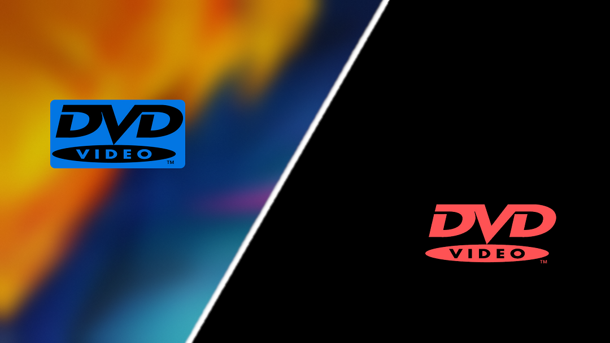

# BouncyDVD

BouncyDVD is a Rainmeter based skin that simulates the bouncing dvd logo screensaver.

## Overview

    
## Features

  - Use BouncyDVD as screensaver with the autodetect idle of your PC ( default is 120 seconds)
  - Shortcuts to lock/unlock into the screensaver ( shortcuts can be changed )
  - Customize the logo between 5 styles (squarish+inverted, rounded+inverted and transparent )
  - Customize the background between 5 styles (transparent, acrylic , blur, semiransparent and filled)
  - Change the color of the logo for each side of bounce

## Installation

BouncyDVD to works need [Rainmeter](https://www.rainmeter.net/)
There are 2 important steps needed to use a Skin with Rainmeter
1 - [How to install Rainmeter](https://docs.rainmeter.net/manual/installing-rainmeter/)
2 - [How to install Skins](https://docs.rainmeter.net/manual/installing-skins/)

For the second step you need the skin file wich have extension *.rmskin*
So you have to download the latest skin file of BouncyDVD available in [Releases](https://github.com/d3ward/bouncydvd/releases)

## Contributing & Support 
If you want , you can contribute by opening an issue for bugs or a feature.

You can also fork the project and do whatever you want ( Share and Adapt ) as long as you respect the terms in the license

## Credits

 [RainRGB Tool by Jeffrey Morley](https://forum.rainmeter.net/viewtopic.php?f=127&t=6215)
 [NoCursor by Jeffrey Morley](https://forum.rainmeter.net/viewtopic.php?p=97898#p97898)
 [FrostedGlass Plugin by theAzack9](https://forum.rainmeter.net/viewtopic.php?t=23106) 

 Logos edited with [GIMP](https://www.gimp.org/)
 - [Rainmeter Logo](https://forum.rainmeter.net/viewtopic.php?t=28819) 
 - [DVD Logo](https://it.wikipedia.org/wiki/File:DVD_logo.svg) 
 
## License

This project is under [CC BY-NC-SA 4.0](https://creativecommons.org/licenses/by-nc-sa/4.0/) License
